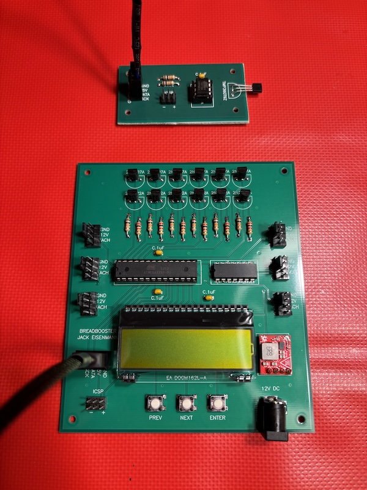

# BreadBooster

Have you ever found yourself living in a 1950's-era house with unbalanced non-adjustable hot water radiators? What? You haven't? Well, too bad! BreadBooster is a device which blows air through your radiator when it detects that the radiator is warm. This allows the heat to dissipate faster than by convection alone. 

## Design Flaw

Through my testing, I found that the main microcontroller is unable to turn the fans *off*. Each fan is driven by a PNP transistor with the following connections:

* The emitter is connected to 12 V.
* The base is connected to GPIO through a 2 kOhm resistor.
* The collector is connected to the fan.

My original plan was to control the transistor by switching the GPIO between these two states:

* GPIO output driven low
* GPIO input with internal pull-up resistor disabled

I reasoned that this should work, because the transistor will only be enabled if current flows from the emitter to the base. Normally a GPIO input with internal pull-up resistor disabled behaves as an open circuit. However, the microcontroller has internal protection diodes which allow current to pass when voltage is outside the range of GND to VCC. As a result, about 3 mA flows even when the GPIO is configured as an input. This causes the transistor to be enabled, and the fans run when I don't want them to.

I feel embarrassed to have made this mistake, but at least I learned a lesson: Do NOT use GPIO to control current through a resistor to voltage above VCC! Current will flow even if the GPIO is an input!

As it stands, **the current BreadBooster design does not work, so do not build it yourself!** The design could be salvaged by adding an additional NPN transistor before each PNP transistor. Maybe I will try that soon...

## Parts List

BreadBooster uses the PCB design file "BreadBooster after ground plane.pcb" in the "pcbFiles" directory of this repo. I used the service https://www.pad2pad.com to print the PCB. I cut the PCB into a "main board" and "satellite board". The satellite board measures radiator temperature and sends the measurements over a cable to the main board. The main board then decides whether to turn the fans on or off.

Beyond the PCB, BreadBooster uses these parts:

* (x1) Main microcontroller: ATMEGA328P-PU
* (x1) Satellite microcontroller: ATTINY13A-PU
* (x1) 28 pin IC socket: 1-2199298-9
* (x1) 8 pin IC socket: 1-2199298-2
* (x4) 3 pin male header: 826926-3
* (x4) 0.1 uF capacitor: K104K15X7RF5TL2
* (x1) Temperature sensor: TMP36GT9Z
* (x1) 5V step-down converter: [BabyBuck Regulator](https://www.sparkfun.com/sparkfun-babybuck-regulator-breakout-5v-ap63357.html)
* (x1) 4 pin male header: 826926-4
* (x6) PNP transistors: 2N2907A
* (x1) 13 bussed 10 kOhm resistors: 4114R-2-103LF
* (x2) 10 kOhm resistor: CFR-25JB-52-10K
* (x6) 2 kOhm resistor: CFR-25JB-52-2K
* (x1) 2 x 16 character display: EA DOGM162L-A
* (x2) 2 pin female header: M20-7820246
* (x1) 20 pin female header: M20-7822046
* (x3) Button: B3F-1000
* (x1) Barrel jack connector: 694106301002
* (x2) 4 pack of 4 wire PC fan extension cables: [B0CNLDNZB2](https://www.amazon.com/Cable-Matters-4-Pack-PWM-Extension/dp/B0CNLDNZB2)
* (x7) 4 wire PC fan male connector: [CO063-B](https://www.moddiy.com/products/4184/4-Pin-3-Pin-Male-Fan-Connector-Black.html)
* (x1) 4 pin female header: M20-7820446
* (x2) 3 pack of PC fans: [B0CD7P3S8Q](https://www.amazon.com/DARKROCK-Computer-Performance-Hydraulic-Warranty/dp/B0CD7P3S8Q)
* (x1) 12V power supply: QFWB-36-12-US01

## Microcontroller Pinouts

Main microcontroller pinout:

* Pin 1 = PC6 = MCU reset
* Pin 2 = PD0 = Fan 2 tachometer
* Pin 3 = PD1 = Fan 1 tachometer
* Pin 4 = PD2 = Fan 3 tachometer
* Pin 5 = PD3 = Satellite clock
* Pin 6 = PD4 = Satellite data
* Pin 7 = VCC
* Pin 8 = GND
* Pin 9 = PB6 = Display reset
* Pin 10 = PB7 = Display select
* Pin 11 = PD5 = Previous button
* Pin 12 = PD6 = Next button
* Pin 13 = PD7 = Enter button
* Pin 14 = PB0 = Fan 6 tachometer
* Pin 15 = PB1 = Fan 5 tachometer
* Pin 16 = PB2 = Fan 4 tachometer
* Pin 17 = PB3 = Display data
* Pin 18 = PB4 = Display mode
* Pin 19 = PB5 = Display clock
* Pin 20 = AVCC
* Pin 21 = AREF
* Pin 22 = GND
* Pin 23 = PC0 = Fan 4 control
* Pin 24 = PC1 = Fan 5 control
* Pin 25 = PC2 = Fan 6 control
* Pin 26 = PC3 = Fan 3 control
* Pin 27 = PC4 = Fan 2 control
* Pin 28 = PC5 = Fan 1 control

Satellite microcontroller pinout:

* Pin 1 = PB5 = MCU reset
* Pin 2 = PB3 = Temperature
* Pin 3 = PB4 = Satellite clock
* Pin 4 = GND
* Pin 5 = PB0 = MCU MOSI
* Pin 6 = PB1 = Satellite data
* Pin 7 = PB2 = MCU SCK
* Pin 8 = VCC

